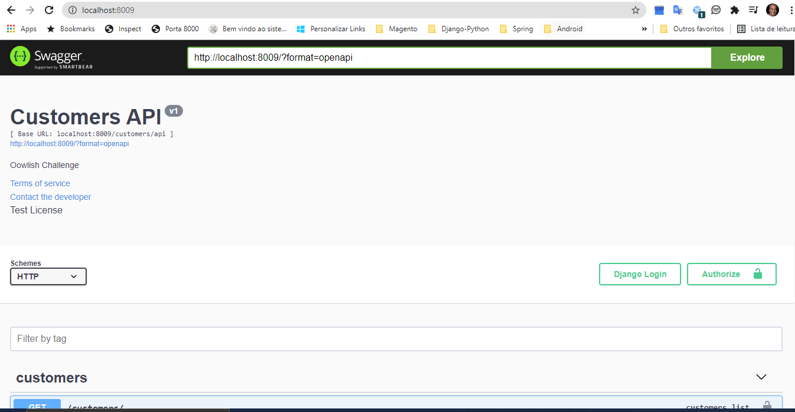
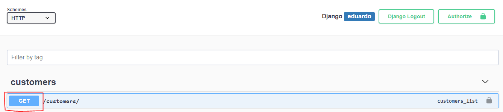
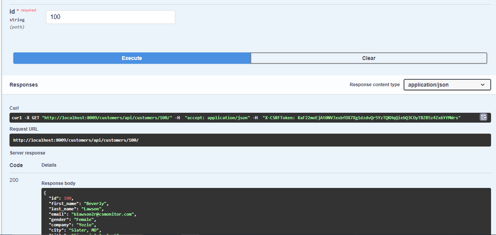

# Managing Customers
## The task at hand:
- Create a simple Django REST API which provides information about customers.
- Create a django management command to import the customers.csv file into your database;  
- Create two extra fields for latitude and, longitude and, fill them up by customer's address using any 
 Geolocation API
- Implement a REST API with two endpoints: one for listing all customers and, another one for getting
a single customer by its id 
- Create a simple web page to consume the REST API (you can use auto-documentation like djangoyasg);
S. 
- Write README.md instructions on how to get your code up-and-running;

## How to install
- First, clone the repo
```
git clone https://github.com/Eduardo-Lucas/oowlish.git
```
- Then, fire up the container
```
docker-compose up -d
```
- Finally, navigate to [localhost:8009][1] in order to see the first page 

[1]: http://localhost:8009

## How to use

- That is the first page

  
- To see all the customers

  
- To see only one customer

  
## Contact
- Eduardo Lucas
- Cell phone: (55) 71 99118-2592
- E-mail: eduardolucas40@gmail.com